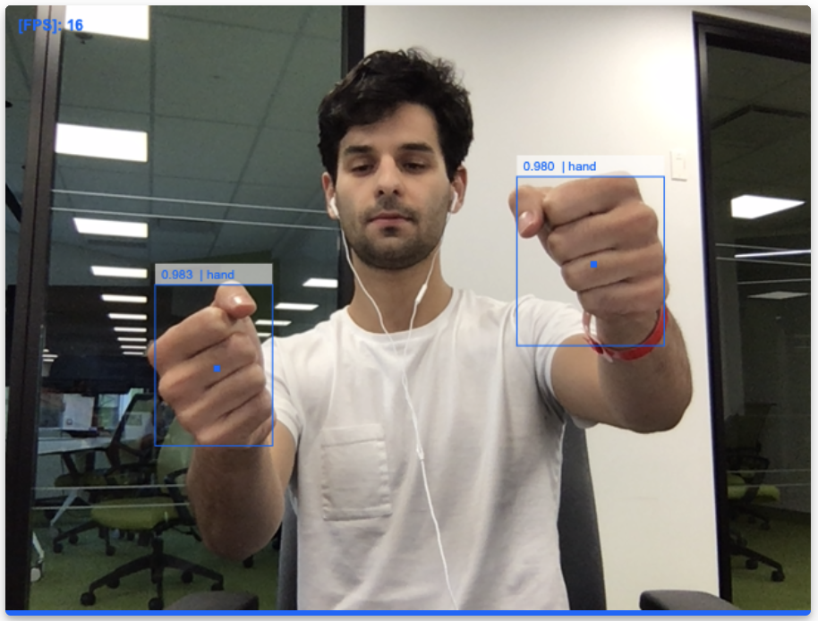
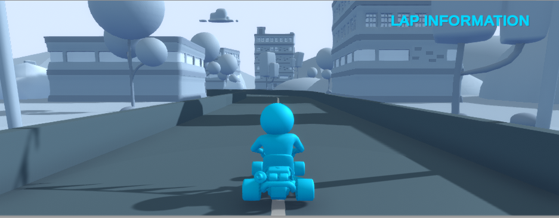

# Keyboard Free Racing
#


This project is a submission for the 2019 edition of Implement.ai

## Authors
	Nicolas Bayard
	Loïc Bellemare-Alford
	Xhulio Hasani

## Goal

This project was an exploration of different technologies and a tryout at assembling them in a single project. We wanted the final product to be fun and nice to play with.

## Social Impact

While the main goal of the experience was to provide a fun demonstration of different technologies, we kept in mind that this kind of application might have social importance. Use of NLP, NLU and computer vision is an excellent way to provide people with handicaps the possibility to use certain tools and do activities that would otherwise be impossible for them. While for this project, the front end is a small karting game, the idea could potentially be applied to a real car or machinery. 

## Technologies

The project consists of 4 different modules

	1. A computer vision module
	2. A NLP module
	3. A Unity WebGL front-end
	4. An Electron app

### Computer vision module

By using the Wrnch.ai API and a [TensorFlow model](https://github.com/victordibia/handtracking), we were able to detect the position of the hands of the user. Once we know where the hands are located, it is fairly easy to simulate a steering wheel using simple trigonometry.

The module runs on his own thread and communicates with the WebGL application via web-sockets.



 
### NLP module

We used [DialogFlow](https://dialogflow.com/) as our NLP model, we trained it with a few commands. These commands were then fed to the WebGL application in the same way as the computer vision module, a web-socket. 

### Unity WebGL 3D environment

The 3D environment created with Unity is a customized and enhanced version of a simple tutorial of the Unity game engine. This environment serves as the front-end of our application and is fed with the inputs of the two precedent inputs.



### The Electron App

The [Electron](https://electronjs.org/) app is a cross platform desktop application. It serves as the host of the WebGL application and the manager of the input modules.

## How to run
```
cd electron
npm run start
```